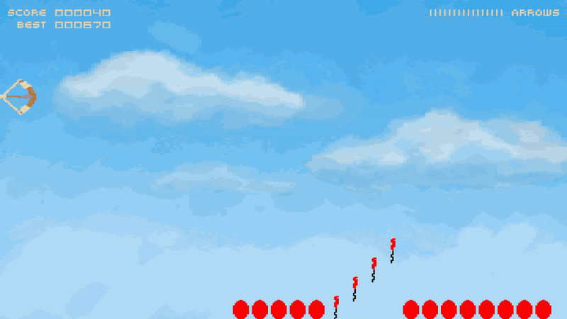

# Throw an Arrow

## What is it?

Throw an Arrow is a game inspired by an old title [Bow and Arrow][1].

It was created by Jakub Młokosiewicz for [Gynvael's Summer GameDev Challenge 2018][2].

## [Play it online][3]
[][3]

## Requirements

Game requires a browser in order to run. index.html has to be served by an HTTP server.
It was tested on desktop using Chromium (Chrome) 68 and Firefox 61, and on a touchscreen device with Android using Chrome 68 and Firefox 61.

## Controls

The game can be controlled by a mouse or by a touchscreen.

Mouse: right click to load an arrow, left click (and hold) to strain the bow, release the button to release the arrow. Move the bow up and down by moving the mouse while holding left mouse button.

Touchscreen: touch anywhere on screen to load an arrow and strain the bow, release to release the arrow. Move the bow up and down by moving finger while touching.

## Licenses

The code is licensed under MIT.

For assets' licensing information please consult [assets/CREDITS.md](assets/CREDITS.md).

[1]: https://archive.org/details/BowandArrow_1020
[2]: https://gynvael.coldwind.pl/?id=686
[3]: https://hckr.pl/throw-an-arrow/
